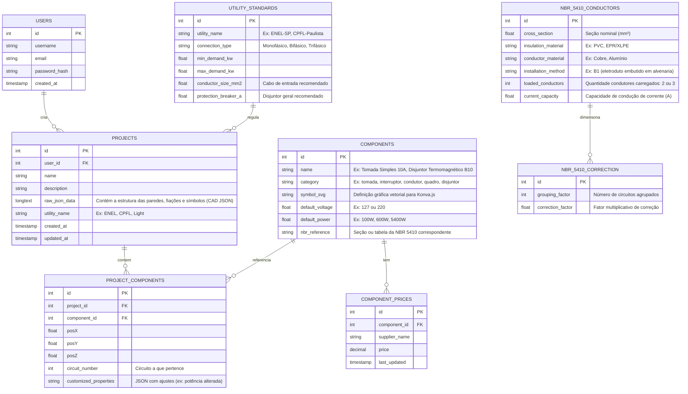

# CORE_ARCHITECTURE.md

Este documento estabelece a arquitetura de software, a modelagem de banco de dados MySQL e o Roadmap de implementação do software de projetos elétricos residenciais e prediais.

---

## 1. Arquitetura de Pastas (Front-End & Back-End)

Adotaremos uma estrutura organizada para separar claramente o front-end (interativo e baseado em canvas) e o back-end (responsável por autenticação, persistência, cache de catálogo de preços e processamento pesado de cálculos elétricos).

```
eletric-sf/
├── client/                           # Front-End (React + TypeScript + Vite)
│   ├── public/                       # Assets estáticos de uso público
│   ├── src/
│   │   ├── assets/                   # Símbolos elétricos SVG normativos e ícones
│   │   ├── components/               # UI Reutilizável (Painel de Propriedades, Botões, Modais)
│   │   │   ├── Cad2D/                # Componentes visuais do Canvas 2D
│   │   │   ├── Render3D/             # Visualizador e elementos Three.js
│   │   │   └── Diagram/              # Componentes do Diagrama Unifilar
│   │   ├── context/                  # Provedores de estado e preferências locais
│   │   ├── hooks/                    # Hooks customizados (useKonva.ts, useThree.ts)
│   │   ├── services/                 # Comunicação com a API (Axios ou tRPC)
│   │   ├── store/                    # Gerenciamento de Estado (Zustand para renderização em tempo real)
│   │   │   └── useCadStore.ts        # Árvore de dados CAD (paredes, nós, circuitos, cabos)
│   │   ├── utils/                    # Algoritmos e cálculos
│   │   │   ├── pathfinding.ts        # Algoritmo de roteamento automático de fiação (e.g. A* ou Dijkstra em grafos)
│   │   │   ├── nbr5410.ts            # Lógica matemática de dimensionamento elétrico
│   │   │   └── geometry.ts           # Interseções de retas, projeções ortogonais e snap de grid
│   │   ├── views/                    # Telas principais
│   │   │   ├── Cad2DView.tsx         # Tela do editor 2D (Konva.js)
│   │   │   ├── Render3DView.tsx      # Tela de visualização 3D (Three.js)
│   │   │   └── UnifilarView.tsx      # Tela do diagrama unifilar (React Flow)
│   │   ├── App.tsx                   # Entrada de visualização e roteamento client-side
│   │   ├── index.css                 # Design System (variáveis HSL, temas escuro/claro e reset)
│   │   └── main.tsx                  # Ponto de entrada do React
│   ├── package.json
│   ├── tsconfig.json
│   └── vite.config.ts
│
├── server/                           # Back-End (Node.js + Express/tRPC)
│   ├── src/
│   │   ├── config/                   # Conexões de banco de dados e chaves de ambiente
│   │   │   └── database.ts
│   │   ├── controllers/              # Controladores HTTP / Handlers tRPC
│   │   ├── db/                       # Versionamento do Banco de Dados
│   │   │   ├── migrations/           # Criação e modificação de tabelas
│   │   │   └── seeds/                # Carga de catálogo normativo NBR 5410 e preços iniciais
│   │   ├── middleware/               # Middleware de validação e segurança
│   │   ├── models/                   # Definição e consultas sql das tabelas
│   │   ├── routes/                   # Endpoints expostos pelo servidor
│   │   ├── services/                 # Lógica de negócio (cálculos complexos paralelos)
│   │   └── app.ts                    # Inicialização e escuta da porta do Express/tRPC
│   ├── package.json
│   └── tsconfig.json
└── CORE_ARCHITECTURE.md              # Bíblia técnica do projeto
```

---

## 2. Modelo Relacional do MySQL

O banco de dados armazena dados de projetos, preços de componentes do mercado, especificações normativas brasileiras (NBR 5410) e especificações de concessionárias elétricas locais.



---

## 3. Roadmap do Projeto (5 Fases)

### **Fase 1: Setup e Infraestrutura Base**
- **Escopo**:
  - Estruturação do monorepo e pastas (`/client` e `/server`).
  - Configuração do TypeScript estrito nos dois ambientes.
  - Setup do banco MySQL e execução das primeiras migrations de tabelas básicas (`users`, `projects`).
  - Criação da tela padrão do dashboard e roteamento no React.
- **Validação**: Testes de conexão com o banco e inicialização dos servidores sem warning.

### **Fase 2: Motor CAD 2D (Konva.js)**
- **Escopo**:
  - Construção da folha de desenho (Stage, Grid dinâmico de engenharia e Snaps automáticos).
  - Algoritmo de desenho de paredes em 2D (cálculo de espessuras, junções em L e T).
  - Importação de planta baixa base (Imagem/PDF) com ferramenta de calibração de escala por distância de referência, permitindo desenhar por cima de projetos arquitetônicos existentes.
  - Biblioteca de símbolos elétricos padrão NBR (Tomadas, Interruptores, QDC, Lâmpadas, Postes e Caixas de Medição padrão Enel/CPFL) arrastáveis para o canvas.
  - Acoplamento magnético dos símbolos nas paredes (alinhamento automático de tomadas e interruptores) e inserção do Padrão de Entrada.
- **Validação**: Testes funcionais no navegador simulando a importação de uma imagem de planta, sua calibração de escala, desenho de paredes correspondentes e snap de tomadas normativas e padrão de entrada.

### **Fase 3: Lógica Elétrica e Cálculos (NBR 5410)**
- **Escopo**:
  - Interface para agrupar dispositivos em **Circuitos** (atribuição de ID de circuito e QDC de destino).
  - Cálculo de Potência Instalada total e Fator de Demanda.
  - Dimensionamento automático de cabos (Seções mínimas de 1.5mm² para iluminação e 2.5mm² para tomadas).
  - Algoritmo de dimensionamento da bitola do cabo baseado em:
    - Corrente de projeto ($I_p$).
    - Fator de agrupamento e fator de temperatura.
    - Limite de queda de tensão admissível (máximo de 4% entre QDC e terminal).
  - Dimensionamento dos disjuntores de proteção termomagnética.
- **Validação**: Tabela de dimensionamento gerada no painel com base nos dados do banco e exportação de relatório PDF.

### **Fase 4: Roteamento de Fiação, Unifilar e Orçamentos**
- **Escopo**:
  - Traçado manual e automático de eletrodutos (conduítes) interligando caixas de passagem.
  - **Algoritmo de Roteamento de Cabos**: Implementação de algoritmo em grafo (A* ou Dijkstra) para calcular o menor caminho percorrido pelos cabos através dos eletrodutos do QDC até os pontos de consumo.
  - Identificação de quais fios passam em cada eletroduto (Fase, Neutro, Terra, Retornos) com anotação visual normativa no 2D.
  - Integração com **React Flow** para renderizar dinamicamente o Diagrama Unifilar do QDC.
  - Geração de Lista de Materiais e cálculo de orçamento integrado com a tabela de preços.
  - **Geração de PDF Profissional Consolidado**: Desenvolvimento de motor de exportação em PDF que une de forma paginada e harmoniosa a planta baixa 2D, a legenda de símbolos elétricos utilizados, o diagrama unifilar e a planilha de orçamento e materiais, incorporando cabeçalhos profissionais e o logotipo do usuário para entrega final.
- **Validação**: Desenhar um circuito simples, traçar eletrodutos, verificar o roteamento automático 2D e exportar um PDF consolidado contendo a planta, a legenda de símbolos, o diagrama unifilar e a listagem de orçamento.

### **Fase 5: Renderização 3D (Three.js)**
- **Escopo**:
  - Construção do motor de extrusão 2D para 3D.
  - Geração das paredes em malhas tridimensionais com base nos polígonos 2D.
  - Posicionamento automático no espaço 3D dos conduítes embutidos (teto e paredes) e caixas de tomada/interruptor (alturas padronizadas: 30cm, 110cm e 220cm do piso).
  - Navegação orbital em primeira pessoa na maquete elétrica 3D.
- **Validação**: Navegar na maquete 3D e conferir o posicionamento espacial correto de todas as tomadas e eletrodutos.
